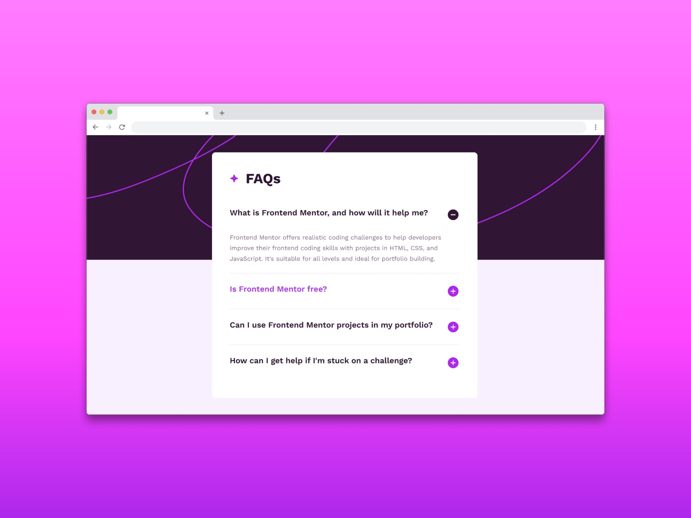

# Acordeón de preguntas frecuentes (Faq accordion)

Un FAQ (Preguntas Frecuentes) es una sección en un sitio web construida a partir de una lista organizada de preguntas y respuestas diseñadas cuidadosamente para abordar las consultas más habituales de los usuarios sobre un tema específico, como productos, servicios o políticas de una empresa. Este formato permite a los visitantes del sitio web encontrar información de forma rápida y sencilla, sin necesidad de contactar directamente con el equipo de atención al cliente.

## ¿Por qué es importante una sección de FAQ?

Tener una sección de FAQ es importante porque:

- Mejora la experiencia del usuario al proporcionar respuestas rápidas a preguntas frecuentes.
- Reduce la carga de trabajo del servicio de atención al cliente.
- Mejora el posicionamiento SEO del sitio web ya que ofrece contenido relevante y valioso para los usuarios.
- Proporciona información esencial para la toma de decisiones.
- Aumenta la confianza en la marca porque demuestra que la empresa se preocupa por responder a las preguntas de sus clientes.

En resumen, una sección de FAQ bien elaborada es una herramienta valiosa para cualquier sitio web, ya que mejora la experiencia del usuario, optimiza los recursos de la empresa y contribuye al éxito general del sitio

## Tecnologías usadas

- HTML
- CSS
- JavaScript

[Ver app🔗](https://seandsun.github.io/monorepo-zero-html-css-js/01-faq-accordion-main/)

  Challenge by <a href="https://www.frontendmentor.io?ref=challenge" target="_blank">Frontend Mentor</a>. 
  Coded by <a href="https://github.com/seandsun">Seandsun</a>.

 <h3 align="center">< seandsun /></h3>