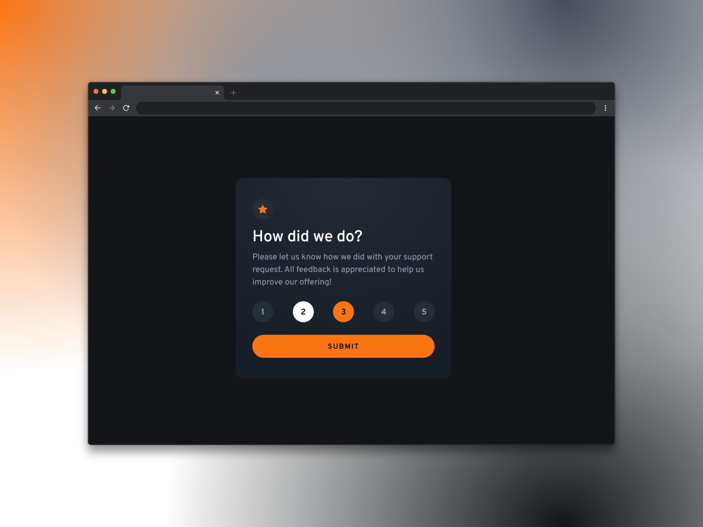

# Componente de calificación interactivo - (Interactive rating component)

Un componente de calificación interactivo, o interactive rating component, sirve para que los usuarios puedan **expresar su opinión** sobre un producto, servicio o experiencia mediante una interfaz que visualmente resulta atractiva e intuitiva. Normalmente, esto se logra seleccionando un número de estrellas (u otro icono representativo) que indica su nivel de satisfacción. 

Un componente de calificación interactivo es importante porque permite:

- Recopilar retroalimentación para mejorar los productos o servicios ofrecidos.
- Medir la satisfacción del cliente ya que sirve como indicador para indentificar qué tal ha sido la experiencia del usuario realizando por ej. una compra o interactuando en la web.
- Facilitar la toma de decisiones ya que las calificaciones pueden influir en las deciciones de compra de otros usuarios debido a que estos pueden ver una opinión general del producto o servicio que desean.

## Tecnologías usadas

- HTML
- Tailwind CSS
- JavaScript

[Ver app🔗](https://seandsun.github.io/monorepo-zero-html-css-js/02-interactive-rating-component-main/dist/)

  Challenge by <a href="https://www.frontendmentor.io?ref=challenge" target="_blank">Frontend Mentor</a>. 
  Coded by <a href="https://github.com/seandsun">Seandsun</a>.

 <h3 align="center">< seandsun /></h3>